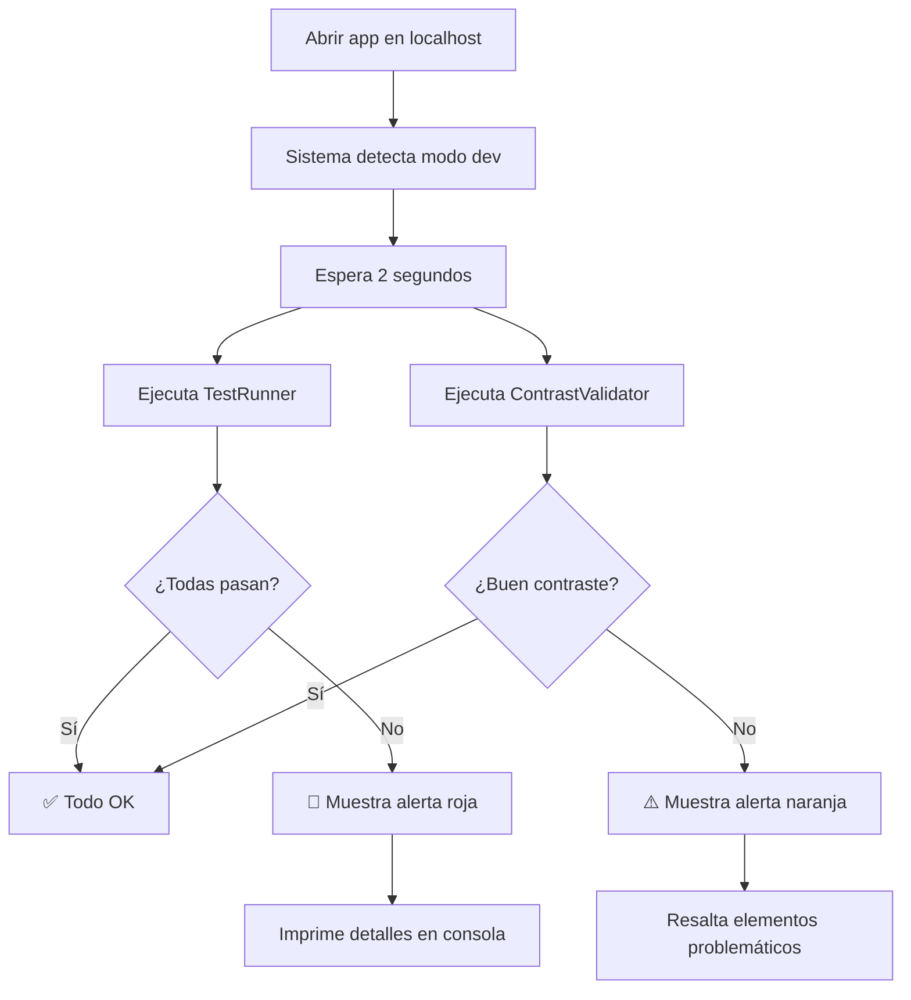

# 🛡️ Sistema de Protección Anti-Regresiones

Este sistema previene automáticamente que los cambios rompan funcionalidades existentes.

---

## 🎯 ¿Qué Protege?

### ✅ Protección Automática Contra:

1. **Funciones Rotas** - Detecta si funciones críticas dejaron de funcionar
2. **Contraste Insuficiente** - Verifica WCAG AA (4.5:1) en todos los elementos
3. **Modo Oscuro Roto** - Valida que dark mode tenga buen contraste
4. **Memory Leaks** - Sistema de limpieza automática de event listeners
5. **Dependencias Faltantes** - Verifica que librerías estén cargadas
6. **DOM Roto** - Detecta si containers críticos existen
7. **XSS Vulnerabilities** - Funciones de sanitización validadas

---

## 🚀 Uso Rápido

### En Desarrollo (localhost)

**Las pruebas se ejecutan automáticamente** cuando abres la app en localhost.

Verás algo así en la consola:

```
🧪 Modo desarrollo detectado - Ejecutando pruebas automáticas...

🧪 TestRunner: Iniciando pruebas automáticas...
✅ PASS: Funciones de sanitización disponibles
✅ PASS: EventManager disponible
✅ PASS: Itinerario puede renderizar
...

📊 RESUMEN DE PRUEBAS
============================================================
✅ Pasadas: 10
⚠️ Advertencias: 0
❌ Fallidas: 0
============================================================
```

### Ejecución Manual

Abre la consola del navegador (F12) y ejecuta:

```javascript
// ✅ Ejecutar TODAS las pruebas
await window.runTests();

// 👁️ Validar solo contraste
window.checkContrast();

// 📊 Ver resultados detallados
console.log(window.testResults);
console.log(window.contrastIssues);

// 🎨 Resaltar elementos con mal contraste
window.contrastValidator.highlightIssues();

// 📈 Ver estadísticas de event listeners
window.eventManager.logStats();
```

---

## 📋 Pruebas Incluidas

### 1. **Funciones de Sanitización** (CRÍTICO)
- ✅ `sanitizeHTML()` existe y es síncrona
- ✅ `escapeHTML()` existe y funciona
- ✅ `sanitizeText()` disponible
- ❌ **Si falla:** Los nombres de actividades mostrarán "undefined"

### 2. **EventManager** (CRÍTICO)
- ✅ EventManager está disponible
- ✅ Método `add()` funciona
- ❌ **Si falla:** Memory leaks y listeners duplicados

### 3. **Itinerario** (CRÍTICO)
- ✅ Container existe en DOM
- ✅ ItineraryHandler disponible
- ❌ **Si falla:** Tab de itinerario vacío

### 4. **Drag & Drop** (CRÍTICO)
- ✅ Sortable.js está cargado
- ❌ **Si falla:** No podrás arrastrar actividades

### 5. **Firebase** (CRÍTICO)
- ✅ Auth inicializado
- ✅ Firestore disponible
- ❌ **Si falla:** No hay sincronización

### 6. **Tabs DOM** (CRÍTICO)
- ✅ Todos los tabs existen
- ❌ **Si falla:** Algunos tabs estarán vacíos

### 7. **Helper Functions** (CRÍTICO)
- ✅ Logger, Validator, DateFormatter disponibles
- ❌ **Si falla:** Errores en validación de datos

### 8. **Chart.js** (Advertencia)
- ✅ Chart.js cargado
- ⚠️ **Si falla:** Gráficos de presupuesto no funcionarán

### 9. **Leaflet.js** (Advertencia)
- ✅ Leaflet cargado
- ⚠️ **Si falla:** Mapas no funcionarán

### 10. **Módulos Nuevos** (Advertencia)
- ✅ EmergencyAssistant, ExpenseSplitter, etc.
- ⚠️ **Si falla:** Nuevas features no disponibles

---

## 🎨 Validación de Contraste

### ¿Qué Verifica?

- ✅ Ratio mínimo 4.5:1 para texto normal
- ✅ Ratio mínimo 3.0:1 para texto grande
- ✅ Modo claro Y modo oscuro
- ✅ Todos los modales
- ✅ Todos los tabs
- ✅ Todos los botones
- ✅ Todos los inputs
- ✅ Todas las cards

### Ejemplo de Salida

```
🔍 ContrastValidator: Escaneando contraste de colores...
✅ Verificados 247 elementos
⚠️ Se encontraron 3 problemas de contraste:

1. .modal-content
   Ratio actual: 2.8:1
   Mínimo requerido: 4.5:1
   Color: rgb(230, 230, 230)
   Fondo: rgb(250, 250, 250)
```

Si hay problemas, verás una alerta visual naranja en pantalla.

---

## 🔧 Cómo Agregar Nuevas Pruebas

### Paso 1: Abrir test-runner.js

```javascript
// js/test-runner.js

// Agregar en la función setupCriticalTests()
testRunner.addTest(
    'Mi nueva prueba',  // Nombre descriptivo
    async () => {
        // Tu lógica aquí
        const result = await checkSomething();

        if (result.isGood) {
            return {
                passed: true,
                message: 'Todo funciona correctamente'
            };
        } else {
            return {
                passed: false,
                message: 'Algo está roto: ' + result.error
            };
        }
    },
    true  // true = crítico, false = advertencia
);
```

### Ejemplo Real: Verificar que Budget Tracker funciona

```javascript
testRunner.addTest(
    'BudgetTracker disponible y funcional',
    async () => {
        // Verificar que existe
        if (typeof window.BudgetTracker === 'undefined') {
            return {
                passed: false,
                message: 'BudgetTracker no está disponible globalmente'
            };
        }

        // Verificar que tiene métodos requeridos
        if (typeof window.BudgetTracker.addExpense !== 'function') {
            return {
                passed: false,
                message: 'Método addExpense no existe'
            };
        }

        return {
            passed: true,
            message: 'BudgetTracker completamente funcional'
        };
    },
    true // crítico
);
```

---

## 🚨 Alertas Visuales

### Pruebas Fallidas

Si algo está roto, verás una alerta ROJA en la esquina superior derecha:

```
⚠️ 3 Prueba(s) Fallida(s)
Se detectaron funcionalidades rotas

[Ver detalles en consola y cerrar]
```

### Problemas de Contraste

Si hay contraste insuficiente, verás una alerta NARANJA en la esquina inferior derecha:

```
👁️ 5 Problema(s) de Contraste
Algunos elementos no cumplen WCAG AA

[Resaltar elementos y cerrar]
```

---

## 🛠️ EventManager - Prevención de Memory Leaks

### Uso Básico

```javascript
import { eventManager } from './event-manager.js';

// ❌ ANTES (forma antigua)
button.addEventListener('click', handleClick);

// ✅ AHORA (forma nueva)
const listenerId = eventManager.add(
    button,           // elemento
    'click',          // tipo de evento
    handleClick,      // handler
    false,            // options
    'myModule'        // nombre del módulo (para cleanup)
);
```

### Cleanup Automático

```javascript
export const MyModule = {
    listenerIds: [],

    init() {
        // Limpiar primero
        this.cleanup();

        // Agregar listeners
        this.listenerIds.push(
            eventManager.add(btn1, 'click', this.handler1, false, 'MyModule'),
            eventManager.add(btn2, 'click', this.handler2, false, 'MyModule')
        );
    },

    cleanup() {
        // Remover todos los listeners del módulo
        eventManager.removeByModule('MyModule');
        this.listenerIds = [];
    }
};
```

### Ver Estadísticas

```javascript
// En consola
window.eventManager.logStats();

// Output:
// 📊 EventManager Stats:
//   Total listeners: 47
//   By module: {itinerary: 12, budget: 8, ...}
//   By event type: {click: 23, input: 15, ...}
```

---

## 📐 Estándares WCAG

### Ratios de Contraste Requeridos

| Tipo de Texto | Ratio Mínimo | Ejemplo |
|---------------|--------------|---------|
| Texto normal (< 18pt) | **4.5:1** | Negro sobre blanco: 21:1 ✅ |
| Texto grande (≥ 18pt) | **3.0:1** | Gris claro sobre blanco: 3.5:1 ✅ |
| Elementos UI | **3.0:1** | Botones, borders, iconos |

### Colores Seguros (Ya en tu app)

```css
/* Estos colores ya garantizan buen contraste */

/* Modo Claro */
background: #ffffff;  /* Blanco */
color: #1f2937;       /* Gris oscuro */
/* Ratio: 15.8:1 ✅ */

/* Modo Oscuro */
background: #1f2937;  /* Gris oscuro */
color: #f3f4f6;       /* Casi blanco */
/* Ratio: 14.2:1 ✅ */
```

---

## 🔄 Flujo de Trabajo Automático



---

## 📊 Métricas de Calidad

### Objetivos del Proyecto

- ✅ **0 pruebas fallidas** en producción
- ✅ **100% WCAG AA** compliance
- ✅ **0 memory leaks** detectados
- ✅ **< 2 segundos** tiempo de carga inicial
- ✅ **100% funcionalidades** críticas operativas

### Verificar Antes de Deploy

```bash
# 1. Correr app en localhost
npm run dev

# 2. Abrir en navegador
open http://localhost:5173

# 3. Abrir consola (F12)
# Debe mostrar:
# ✅ Pasadas: 10
# ❌ Fallidas: 0

# 4. Si hay fallos, NO HACER DEPLOY
```

---

## 🎓 Recursos Adicionales

- 📖 [DEVELOPMENT_GUIDE.md](./DEVELOPMENT_GUIDE.md) - Guía completa de desarrollo
- 🎨 [WCAG Contrast Checker](https://webaim.org/resources/contrastchecker/)
- 🧪 [Testing Best Practices](https://javascript.info/testing-mocha)

---

## ⚡ Tips Pro

### 1. Ejecutar Pruebas Antes de Commit

```bash
# Agregar al pre-commit hook
git commit -m "..."
# Esto debería ejecutar pruebas automáticamente
```

### 2. Modo Debug Verbose

```javascript
// En consola
localStorage.setItem('DEBUG_TESTS', 'true');
// Recargar página
// Verás logs detallados de cada prueba
```

### 3. Desactivar Temporalmente

```javascript
// En app.js, comentar línea:
// setTimeout(async () => { await runAutomatedTests(); }, 2000);
```

### 4. Crear Reporte HTML

```javascript
// En consola
const results = await window.runTests();
console.table(results.passed);
console.table(results.failed);
```

---

## 🐛 Troubleshooting

### "Las pruebas no se ejecutan"

**Causa:** No estás en localhost

**Solución:** Las pruebas solo se ejecutan automáticamente en localhost. Para ejecutar manualmente:
```javascript
await window.runTests();
```

### "Muchos falsos positivos de contraste"

**Causa:** Elementos dinámicos o con backgrounds complejos

**Solución:** El validator puede tener falsos positivos en gradientes. Verifica visualmente.

### "EventManager reporta muchos listeners"

**Causa:** Normal si tienes muchos elementos interactivos

**Solución:** Solo preocúpate si el número sigue creciendo sin parar (memory leak real).

---

**¡El sistema está activo y protegiéndote!** 🛡️

Cada vez que trabajes en localhost, el sistema verificará automáticamente que no rompas nada.
